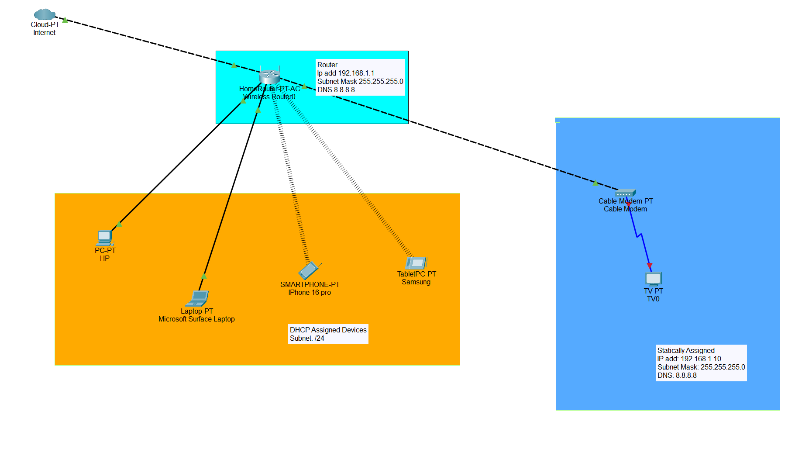
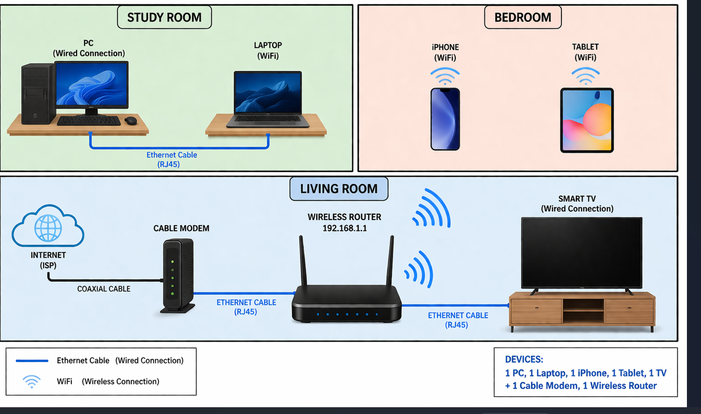

# 🏠 Home Network Documentation

## 📌 Overview
This document provides a complete overview of my home network, including both physical and logical topology, addressing scheme, devices, configurations, and security practices.

---

## 🧠 Logical Topology

### Description
The logical topology represents how devices communicate within the network.

### Devices in Logical Network:
- 1 PC
- 1 Laptop
- 1 Tablet
- 1 iPhone
- 1 Smart TV
- 1 Wireless Router

### Connectivity:
- All devices are connected through a central wireless router.
- Communication is based on a **star topology**.
- Router manages DHCP and internet access.

---

## 🖥️ Physical Topology

### Description
The physical topology shows actual placement of devices and connections.

### Device Locations:
| Device        | Location         | Connection Type | Interface |
|--------------|----------------|----------------|----------|
| Router       | Living Room     | ISP Modem (WAN) | WAN Port |
| PC           | Study Room      | Ethernet        | LAN Port 1 |
| Laptop       | Bedroom         | Wi-Fi           | Wireless |
| Tablet       | Bedroom         | Wi-Fi           | Wireless |
| iPhone       | Living Room     | Wi-Fi           | Wireless |
| Smart TV     | Living Room     | Wi-Fi           | Wireless |

### Cabling:
- Ethernet Cable: Router → PC
- Wireless: Router → All other devices

---

## 🌐 Addressing Documentation

| Device      | IP Address      | MAC Address       | Type     |
|------------|----------------|------------------|----------|
| Router     | 192.168.1.1    | XX:XX:XX:XX:XX:01 | Static   |
| PC         | 192.168.1.10   | XX:XX:XX:XX:XX:02 | DHCP     |
| Laptop     | 192.168.1.11   | XX:XX:XX:XX:XX:03 | DHCP     |
| Tablet     | 192.168.1.12   | XX:XX:XX:XX:XX:04 | DHCP     |
| iPhone     | 192.168.1.13   | XX:XX:XX:XX:XX:05 | DHCP     |
| Smart TV   | 192.168.1.14   | XX:XX:XX:XX:XX:06 | DHCP     |

### Network Details:
- Network: `192.168.1.0/24`
- Default Gateway: `192.168.1.1`
- DNS: Provided by ISP

---

## ⚙️ Network Devices & Services

### 🔹 Router
- Acts as:
  - DHCP Server
  - NAT Device
  - Firewall
- Provides internet access

### 🔹 Services Used:
- DHCP (Automatic IP assignment)
- NAT (Private to Public IP translation)
- Wi-Fi (Wireless connectivity)

---

## 🔧 Device Configurations

### Router Configuration:
- SSID: HomeNetwork
- Security: WPA2/WPA3 Personal
- Password: Strong password configured
- DHCP Range: 192.168.1.10 – 192.168.1.100

### PC Configuration:
- Connected via Ethernet
- Obtains IP via DHCP
- Firewall enabled

### Laptop / Tablet / iPhone:
- Connected via Wi-Fi
- DHCP enabled
- Auto network detection

### Smart TV:
- Connected via Wi-Fi
- Used for streaming services

---

## 🔐 Credential Security

To securely store login credentials, the following method is used:

- Password Manager (e.g., Bitwarden / LastPass)
- Strong passwords (minimum 12 characters)
- Two-Factor Authentication (2FA) enabled
- Default router credentials changed

---

## ✅ Conclusion

This documentation provides a clear and structured overview of the home network. It demonstrates proper understanding of:
- Network topology
- Addressing
- Device configuration
- Security practices

---
